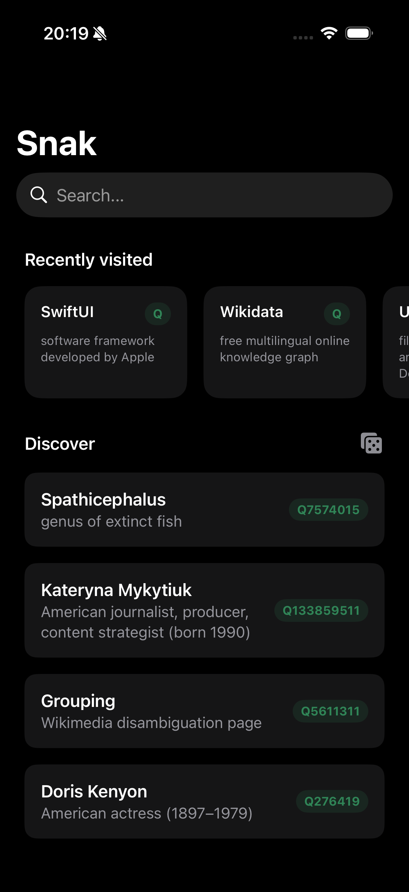
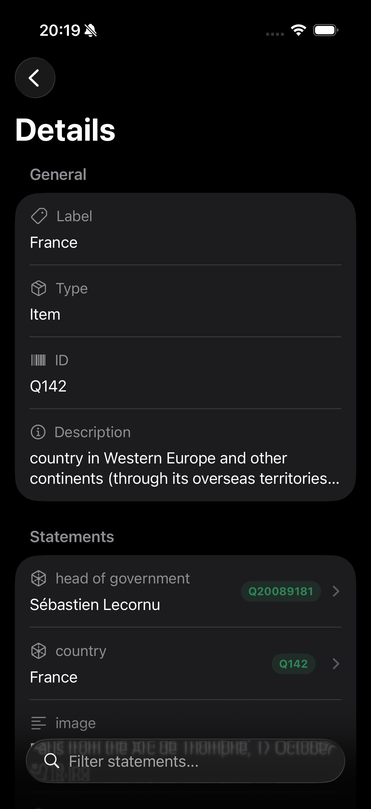
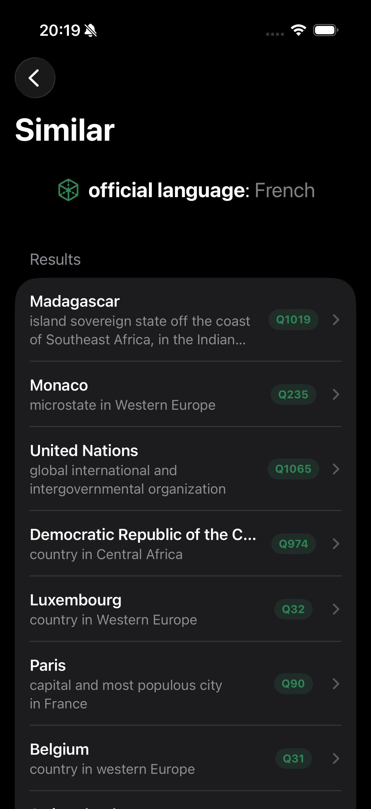

# Snak

A native [Wikidata](https://www.wikidata.org/) browser for iOS and watchOS.

**The project is in its early stages**

# Features

- Search Wikidata items
- Explore and filter the statements of an entity
- Swipe left on a statement to find entities sharing that property/value pair
- Display a short list of random Wikipedia pages
- Keep track of recently visited entities
- A full watchOS companion app

# Screenshots

<p>



</p>

# Install

Download the latest `Snak.ipa` from [releases](https://github.com/0x7375/snak/releases/latest) and install with [AltStore](https://altstore.io) or any IPA installer.

# Building from source

**Requirements:** Xcode

```
git clone https://github.com/0x7375/snak
cd snak
make release
```

Creates an unsigned `Snak.ipa` in project root

